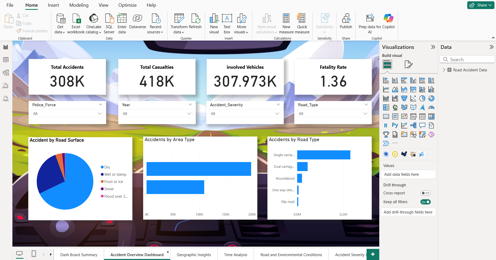
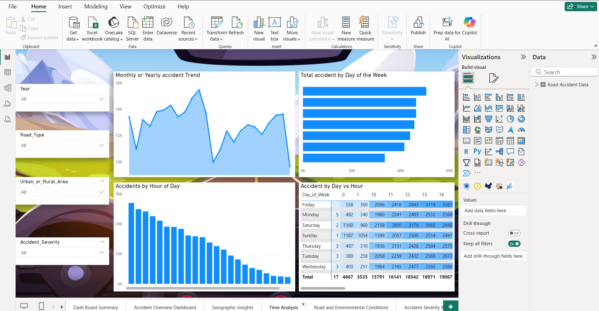
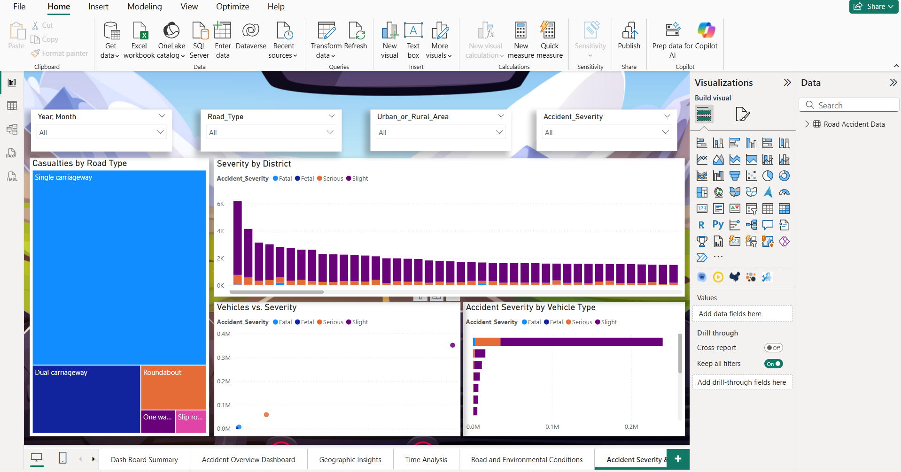

# 🚧 UK Road Accident Analysis Dashboard (Power BI)

This project presents a Power BI dashboard analyzing **road accidents across the United Kingdom**. The dataset was sourced from Kaggle and cleaned using DAX functions to generate meaningful insights. The dashboard helps identify accident hotspots, time-based patterns, and vehicle-type risks.

---

## 📦 Data Source

- Dataset from [Kaggle](https://www.kaggle.com/datasets/devansodariya/road-accident-united-kingdom-uk-dataset)
- Contains records of UK road accidents including:
  - Location
  - Date & time
  - Weather conditions
  - Vehicle types involved
  - Casualties and severity

---

## 🧹 Data Cleaning

- Used **DAX functions** to:
  - Remove null and irrelevant records
  - Standardize date-time formats
  - Create calculated columns (e.g., `Accident Hour`, `Accident Severity Level`)
  - Filter out low-impact noise from large-volume entries

---

## 📊 Step-by-Step Process

1. **Data Collection**  
   - Downloaded `.csv` data from Kaggle

2. **Data Cleaning with DAX**
   - Removed invalid or missing values
   - Used `CALCULATE`, `IF`, `SWITCH`, `FORMAT`, and `RELATED` to enrich data

3. **Modeling**
   - Created relationships between accident, location, and vehicle tables

4. **Dashboard Design**
   - Built interactive visuals using:
     - Heat maps for accident locations
     - Time-series charts (by year, month, hour)
     - Donut charts for severity and casualty types

---

## 💡 Key Insights

- **Peak accident hours**: Most accidents occur between **4 PM – 6 PM**
- **High-risk areas**: Urban regions have higher accident frequency
- **Weather impact**: Rain and fog correlate with increased severity
- **Vehicle types**: Motorcycles and cars are involved in the majority of severe accidents
- **Day of the week**: Weekends show a higher casualty rate per accident

---

## 🖼️ Sample Dashboard Visuals

> _Screenshots from Power BI:_

### 🔸 overview 


### 🔸 Hourly Trend  


### 🔸 Severity by Vehicle Type  


---

## ⚙️ How to Use

1. Clone this repo:
   ```bash
   git clone https://github.com/yourusername/uk-road-accident-dashboard.git
